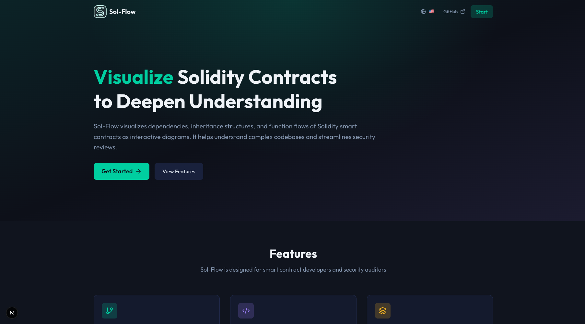

# Getting Started

Welcome to Sol-Flow! This guide will help you get started with visualizing Solidity smart contracts.

## What is Sol-Flow?

Sol-Flow is a tool for visually understanding the structure of Solidity smart contracts.

When developing or auditing smart contracts, understanding the relationships between contracts is crucial. Sol-Flow displays contracts as nodes (boxes) and connects them with edges (lines), making complex contract structures intuitive to understand.

### What Sol-Flow Can Do

| Feature | Description |
|---------|-------------|
| Dependency Visualization | See which contracts use which other contracts at a glance |
| Inheritance Hierarchy | Understand contract inheritance relationships in a tree structure |
| Function Call Tracking | Track which functions a given function calls internally |
| Proxy Pattern Detection | Automatically detect proxy patterns like UUPS, Transparent, ERC-7546, etc. |

## Launching Sol-Flow

When you open Sol-Flow, you'll first see the landing page.

To use the application, click the "Get Started" or "Start Now" button.

## Screen Layout

When you enter the app, you'll see the main interface like this:

### Component Descriptions

| Component | Location | Purpose |
|-----------|----------|---------|
| Header | Top of screen | Access main features like search, import, and export |
| Sidebar | Left side | View imported contracts and built-in libraries |
| Canvas | Center | Main area where contract relationship diagrams are displayed |
| Zoom Controls | Bottom left | Zoom in/out and fit view to screen |

### Header Features

The header contains frequently used features:

| Button/Feature | Description |
|----------------|-------------|
| Logo | Click to return to the home screen |
| Search Bar | Search by contract name, function name, or event name. Also accessible with `Cmd+K` (Mac) or `Ctrl+K` (Windows) |
| Layout Toggle | Switch between grid view and hierarchical view |
| Import Button | Opens dialog to import Solidity files |

### Sidebar Contents

The sidebar lets you manage the currently displayed contracts.

| Section | Description |
|---------|-------------|
| Project Structure | Shows folder structure of imported files |
| Categories | Filter contracts by type (Access Control, Finance, etc.) |
| Legend | View the color meanings for edges |
| Stats | Display statistics like contract count, library count, function count |

### Canvas Operations

You can freely navigate the canvas using mouse or trackpad.

| Operation | Method |
|-----------|--------|
| Pan | Drag the canvas or scroll to move in any direction |
| Zoom | Use mouse wheel or trackpad pinch gesture to zoom in/out |
| Expand Node | Click a contract node to show function details |

## Try It Out

### Step 1: Import Contracts

First, load the Solidity files (`.sol`) you want to analyze into Sol-Flow.

There are two ways to import:

1. **Drag & Drop**: Drag files directly into the browser window and drop them
2. **Import Button**: Click the "Import" button in the header and select files from the file dialog

### Step 2: View the Visualization

Once import is complete, contracts are displayed as nodes (boxes) on the canvas.

If there are multiple contracts, each is displayed as a node, connected by lines (edges) showing their relationships.

### Step 3: Click Nodes for Details

Clicking a contract node highlights the edges showing contracts it inherits from or calls.

Also, clicking a function name within a contract shows all the functions it calls internally.

### Step 4: Understand Relationships

The lines (edges) connecting contracts are color-coded by relationship type.

| Color | Relationship Type | Description |
|-------|-------------------|-------------|
| Blue | Inherits | A contract inherits from another contract |
| Green | Uses | A contract uses another contract |
| Purple | Implements | A contract implements an interface |
| Pink | Delegatecall | Proxy pattern calling an implementation contract |

For detailed color meanings, check the "Legend" section in the sidebar.

## Next Steps

Now that you understand the basics, learn more with these guides:

- [Import](./02-import.md) - Learn detailed import methods
- [Navigation](./03-navigation.md) - Master canvas operations
- [Contract Nodes](./04-contract-nodes.md) - Learn how to read nodes in detail
