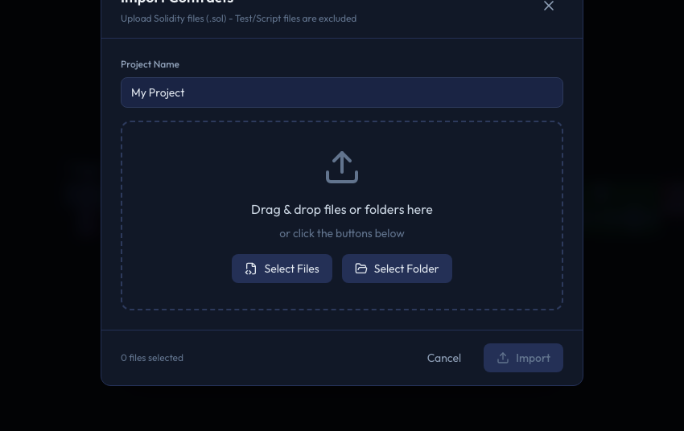
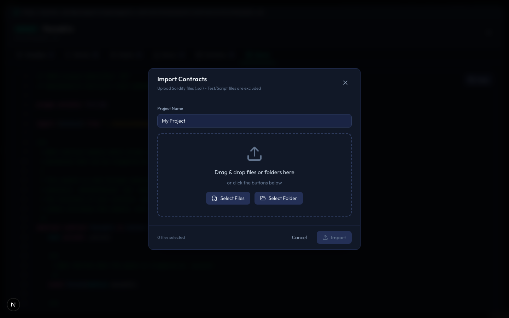
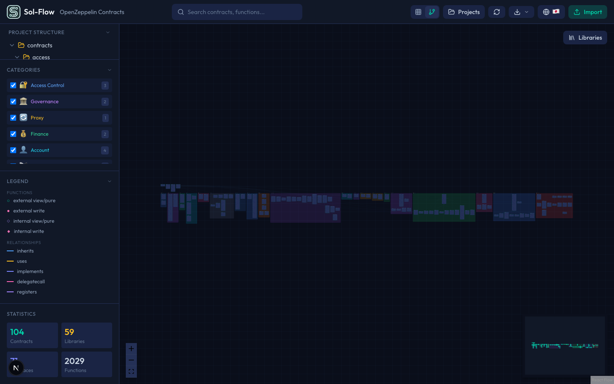

# Import

To analyze contracts in Sol-Flow, you first need to import Solidity files. This guide explains how to import files and what happens after importing.

## Import Methods

There are two ways to import contracts into Sol-Flow. Both methods produce the same result, so choose whichever is more convenient.

### Method 1: Drag & Drop

The easiest method. Simply drag Solidity files from your file manager (Finder, Explorer, etc.) and drop them onto the Sol-Flow window.



1. Select the `.sol` files you want to import in your file manager
2. Drag the files to the Sol-Flow browser window
3. When a drop zone with a dotted border appears, drop the files there

You can select and drag multiple files at once. You can also drag a folder to import all `.sol` files within it.

### Method 2: Using the Import Button

Use the "Import" button in the header. A file selection dialog will open where you can select files to import.



1. Click the "Import" button on the right side of the header
2. The import dialog opens
3. Click "Select Files" to choose files, or drag & drop files onto the drop zone
4. Enter a project name (optional)
5. Click the "Import" button to execute the import

## Supported File Formats

### File Extensions

Currently, Sol-Flow only supports `.sol` Solidity source files.

| Extension | Support | Description |
|-----------|---------|-------------|
| `.sol` | Supported | Solidity source files |
| `.json` | Not supported | ABI files are not currently supported |

### Solidity Versions

Sol-Flow supports a wide range of Solidity versions.

| Version | Support |
|---------|---------|
| Solidity 0.4.x | Supported |
| Solidity 0.5.x | Supported |
| Solidity 0.6.x | Supported |
| Solidity 0.7.x | Supported |
| Solidity 0.8.x | Supported |

Files with version specifications like `pragma solidity ^0.8.0;` are processed without issues.

### Import Statement Resolution

Sol-Flow automatically attempts to resolve import statements in Solidity files.

```solidity
// Relative path imports - automatically resolved from imported files
import "./MyContract.sol";

// Named imports - also automatically resolved
import {ERC20} from "./token/ERC20.sol";
```

**Note**: Imports from external packages like `@openzeppelin/contracts/...` are resolved through Sol-Flow's built-in libraries. However, for custom packages or imports from local `node_modules`, you need to include all necessary files in your import.

## Post-Import Processing

When you import files, Sol-Flow automatically performs the following:

### 1. Parsing

Analyzes the Solidity code to extract contract structure (functions, variables, events, etc.). If there are syntax errors, error messages are displayed at this stage.

### 2. Dependency Analysis

Analyzes relationships between contracts (inheritance, library usage, interface implementation, etc.).

### 3. Proxy Pattern Detection

Automatically detects proxy patterns like ERC-1967, ERC-7546, ERC-2535 (Diamond), etc.

### 4. Visualization Generation

Based on the analysis results, places contract nodes and edges (relationship lines) on the canvas.

Once import is complete, contracts are displayed as a diagram like this:



## Built-in Libraries

Sol-Flow includes commonly used libraries pre-loaded. You can view these libraries from the "Libraries" button in the sidebar without importing.

### OpenZeppelin Contracts

The most widely used smart contract library.

| Category | Included Contracts |
|----------|-------------------|
| Tokens | ERC20, ERC721, ERC1155 and their extensions |
| Access Control | Ownable, AccessControl, AccessManager |
| Security | ReentrancyGuard, Pausable |
| Utilities | Address, Strings, Math |

### Solady

A library providing lightweight, gas-efficient implementations. Offers equivalent functionality to OpenZeppelin at lower gas costs.

### ERC-7546

Reference implementation of the modular proxy pattern. Provides a flexible proxy structure that can call different implementation contracts for each function.

### Avalanche ICM

Libraries for Avalanche blockchain's Interchain Messaging.

## Best Practices

### Project Organization

Tips for efficient analysis.

| Recommendation | Description |
|----------------|-------------|
| Group related files | Import contracts related to one protocol together for proper dependency resolution |
| Separate projects | Manage different protocols as separate projects to keep diagrams readable |
| Import only necessary files | Exclude test files and scripts, importing only core contracts makes organization easier |

### Performance Considerations

Notes for importing large numbers of files.

| Situation | Recommendation |
|-----------|----------------|
| Small (up to 20 files) | Can import all at once without issues |
| Medium (20-50 files) | May take some processing time, but works fine |
| Large (50+ files) | Recommend narrowing down to necessary contracts |

## Troubleshooting

### Parse Errors

Parsing fails if there are syntax errors in the code.

| Cause | Solution |
|-------|----------|
| Syntax error | Check the error message, fix the code, then re-import |
| Unsupported syntax | Very new Solidity features may not be supported |

### Unresolved Dependencies

Errors occur when files specified in import statements cannot be found.

| Cause | Solution |
|-------|----------|
| Missing files | Include the imported files in your import |
| Path mismatch | Check the file structure and ensure all necessary files are included |

## Next Steps

- [Navigation](./03-navigation.md) - Learn how to navigate the canvas
- [Contract Nodes](./04-contract-nodes.md) - Learn how to read and interact with nodes
