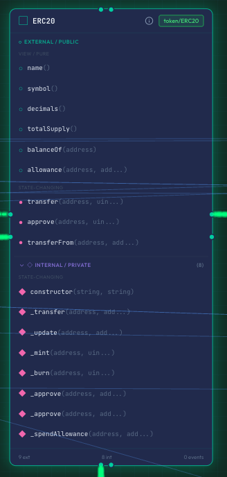
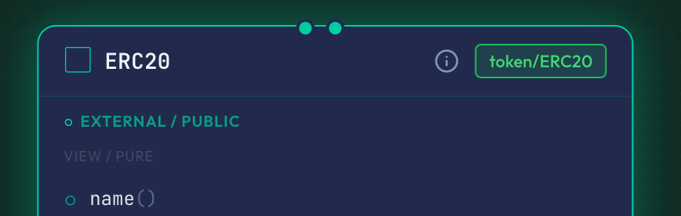
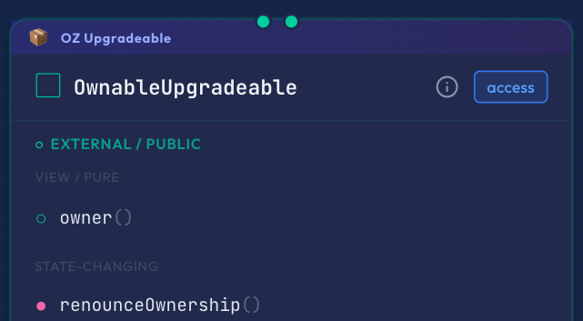
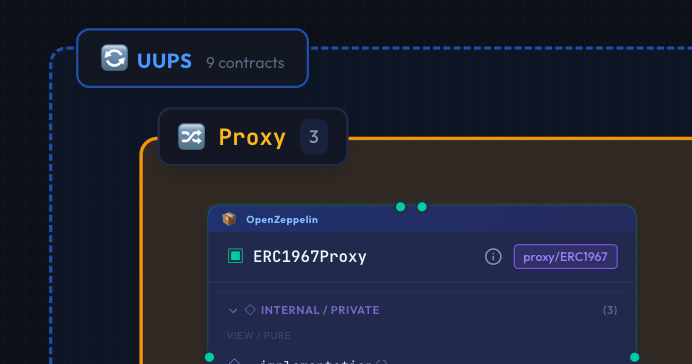
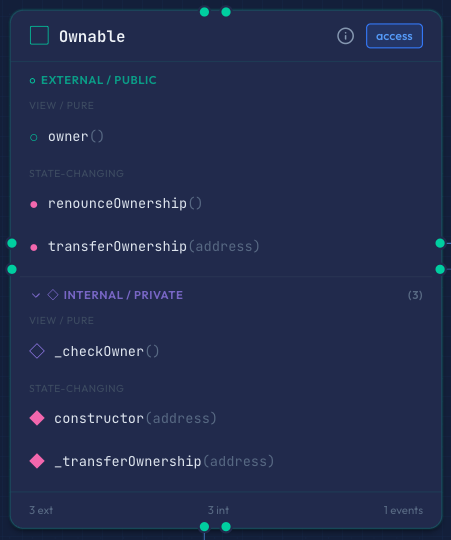
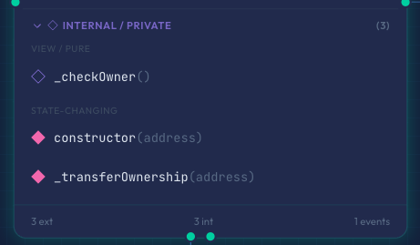

# Contract Nodes

In Sol-Flow, each contract is displayed as a "node" (box). This guide explains how to read and interact with nodes.

## Node Types

Solidity has multiple types of contract definitions, and Sol-Flow visually distinguishes each type.



### Contract (Regular Contract)

The most common smart contract. Has state variables and functions, and can be deployed.

```solidity
contract MyToken {
    string public name = "My Token";
    function transfer(address to, uint256 amount) external { ... }
}
```

#### Node Characteristics

- Displays a filled square icon
- Contains complete implementation

### Interface

Defines only function signatures (names and parameter types) without implementation. Defines a "contract" that other contracts should implement.

```solidity
interface IERC20 {
    function transfer(address to, uint256 amount) external returns (bool);
    function balanceOf(address account) external view returns (uint256);
}
```

#### Node Characteristics

- Displays a diamond-shaped icon
- No function implementation, only signatures

### Library

A collection of reusable utility functions. Has no state and is called by other contracts.

```solidity
library SafeMath {
    function add(uint256 a, uint256 b) internal pure returns (uint256) {
        return a + b;
    }
}
```

#### Node Characteristics

- May display a "Library" badge
- Rarely deployed standalone

### Abstract Contract

A contract that implements only some functions, leaving the rest to inheriting contracts. Cannot be deployed standalone.

```solidity
abstract contract Ownable {
    address public owner;

    modifier onlyOwner() {
        require(msg.sender == owner, "Not owner");
        _;
    }

    // Unimplemented function
    function renounceOwnership() public virtual;
}
```

#### Node Characteristics

- Displays an unfilled square icon
- Some functions remain unimplemented

## Node Components

Each node consists of several sections.

### Header Section

The header at the top of the node displays the following information:

| Element | Description |
|---------|-------------|
| Icon | Indicates contract type (filled square = contract, diamond = interface, unfilled square = abstract) |
| Contract Name | The name of the contract |
| Detail Button | Info icon. Click to open the contract detail modal |
| Category Badge | Labels indicating categories like Access Control, Finance, etc. |



### Library Badge

External library contracts display the library name and version above the header.

| Library | Display Example |
|---------|-----------------|
| OpenZeppelin | OpenZeppelin@5.0.2 |
| Solady | Solady |
| Avalanche ICM | Avalanche ICM |



### Proxy Pattern Badge

Contracts using proxy patterns display the pattern type and role.

| Pattern | Display Example |
|---------|-----------------|
| ERC-1967 (UUPS) | "UUPS" and "Proxy" or "Impl" |
| ERC-7546 | "ERC-7546" and "Dict", "Proxy", "Impl", etc. |
| Diamond (ERC-2535) | "Diamond" and "Facet" |



### Function List

The center of the node displays a list of the contract's functions.



**External / Public Section**

Displays functions callable from outside. Further classified as:

| Classification | Description |
|----------------|-------------|
| view / pure | Read-only functions that don't modify state (green dot) |
| state-changing | Functions that modify state (orange dot) |

**Internal / Private Section**

Displays functions callable only within the contract. This section is collapsible - click "Internal / Private" to expand or collapse.

### Footer Section

The bottom of the node displays statistics.

| Display | Meaning |
|---------|---------|
| X ext | Number of external/public functions |
| Y int | Number of internal/private functions |
| Z events | Number of events |

## Node Operations

### Clicking a Function

Clicking a function name opens the "Function Flow" dialog for that function.
Function Flow shows which functions it calls internally, which events it emits, and more.

See [Function Flow](./07-function-flow.md) for details.

### Clicking the Detail Button

Clicking the detail button (info icon) in the node header opens the Contract Detail modal.
Here you can view not just functions, but also state variables, structs, events, errors, and source code.

See [Contract Details](./06-contract-details.md) for details.

### Moving Nodes

Drag nodes to move them to any position on the diagram. Positions are automatically saved.


### Expanding/Collapsing Internal/Private Section

Click "Internal / Private" to expand or collapse the internal functions section.



## Efficient Usage

### Tips for Readable Diagrams

| Tip | Description |
|-----|-------------|
| Expand frequently viewed nodes | Keep internal function sections expanded for contracts you check often |
| Keep related nodes close | Place contracts with inheritance relationships or frequently used together nearby |
| Collapse unnecessary sections | Collapse nodes where you don't need to see internal functions for a cleaner diagram |

### Efficiently Accessing Information

| Goal | Method |
|------|--------|
| View function details | Click function name to open Function Flow |
| View source code | Click detail button, select "Source" tab |
| Check state variables | Click detail button, select "Variables" tab |
| View event list | Click detail button, select "Events" tab |

## Next Steps

- [Relationships](./05-relationships.md) - Understand what edges (lines) between nodes mean
- [Contract Details](./06-contract-details.md) - Learn how to use the detail modal
