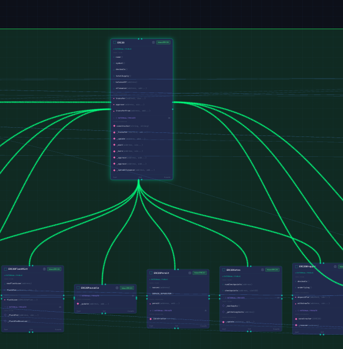

# Relationships (Edges)

In Sol-Flow, relationships between contracts are expressed as lines called "edges". This guide explains the meaning and how to read each edge.

## What are Edges?

Lines connecting contract nodes in the diagram are called "edges". Edges visually show what kind of relationship one contract has with another.

In the image below, relationships between multiple contracts are shown as edges (lines).



The color and style (solid/dashed) of edges represent the type of relationship.

## Edge Types

Sol-Flow displays edges in different colors and styles for each relationship type.

### Inheritance (inherits)

Shows when one contract inherits from another contract.

```solidity
// MyToken inherits from ERC20
contract MyToken is ERC20 {
    // Inherits ERC20's functionality
}
```

| Property | Value |
|----------|-------|
| Color | Blue |
| Style | Solid line |
| Direction | Child contract -> Parent contract |
| Meaning | Arrow source inherits from arrow target |

### Implementation (implements)

Shows when a contract implements an interface. Interfaces typically have names starting with "I" (e.g., `IERC20`).

```solidity
// MyToken implements the IERC20 interface
contract MyToken is IERC20 {
    // Implements all functions defined in IERC20
    function transfer(address to, uint256 amount) external returns (bool) { ... }
}
```

| Property | Value |
|----------|-------|
| Color | Purple |
| Style | Solid line |
| Direction | Implementing contract -> Interface |
| Meaning | Arrow source implements arrow target interface |

The difference between inheritance and implementation is automatically determined based on whether the target is an interface (names starting with "I" where the second character is uppercase are treated as interfaces).

### Library Usage (uses)

Shows when a contract uses a library.

```solidity
// Using SafeMath library for uint256 type
using SafeMath for uint256;

contract MyToken {
    function add(uint256 a, uint256 b) public pure returns (uint256) {
        return a.add(b);  // Calls SafeMath.add
    }
}
```

| Property | Value |
|----------|-------|
| Color | Yellow/Amber |
| Style | Dashed line |
| Direction | User -> Library |
| Meaning | Arrow source uses arrow target library |

### Delegatecall

Shows a special call relationship used in proxy patterns. The proxy contract executes the implementation contract's code in its own context.

```solidity
// Proxy delegates call to implementation contract
(bool success, ) = implementation.delegatecall(data);
```

| Property | Value |
|----------|-------|
| Color | Pink |
| Style | Dashed line |
| Direction | Proxy -> Implementation |
| Meaning | Arrow source (proxy) calls arrow target (implementation) via delegatecall |

### Registers

A relationship used in the ERC-7546 modular proxy pattern. Shows that an implementation contract is registered in a dictionary contract.

```solidity
// Register function selector and implementation address in dictionary
dictionary.setImplementation(bytes4(keccak256("transfer(address,uint256)")), implAddress);
```

| Property | Value |
|----------|-------|
| Color | Violet |
| Style | Dashed line |
| Direction | Dictionary -> Implementation |
| Meaning | Arrow target (implementation) is registered in arrow source (dictionary) |

## Reading Edges

### Direction Meaning

Edge arrows point from the "using side" to the "used side".

```
MyToken ──inherits──> ERC20
  |
  └──uses──> SafeMath
```

In the example above:
- MyToken inherits from ERC20 (MyToken -> ERC20)
- MyToken uses SafeMath (MyToken -> SafeMath)

### Multiple Edges

When a contract has relationships with multiple contracts, multiple edges are displayed.

```
MyGovernanceToken ──inherits──> ERC20
       |              └──────> Ownable
       |                  └──> Pausable
       └──uses──> SafeMath
```

### Edge Selection

Clicking an edge highlights it. This is useful for identifying specific relationships in complex diagrams with many edges.

## Understanding Dependencies

### Benefits of Understanding Inheritance

Understanding inheritance relationships helps you know:

| Information | Details |
|-------------|---------|
| Available functions | Parent contract functions are also available in child contracts |
| Override confirmation | Which functions are inherited from parents, which are overridden |
| Access control inheritance | Whether parent contract modifiers and roles are inherited by child contracts |

### Benefits of Understanding Library Usage

Understanding library usage relationships helps you know:

| Information | Details |
|-------------|---------|
| Utilities in use | Which helper functions are available |
| Gas optimization potential | Consider replacing with more efficient libraries |
| Common pattern discovery | Whether the same library is used across multiple contracts |

### Benefits of Understanding Proxy Relationships

Understanding proxy relationships helps you know:

| Information | Details |
|-------------|---------|
| Upgrade path | Which contracts are upgradeable |
| Actual logic | Where the code actually executed via proxy resides |
| Storage location | Which contract stores the data |

## Custom Edges

Sol-Flow also allows you to manually add relationships not detected by static analysis. See [Edit Mode](./09-edit-mode.md) for details.

## Next Steps

- [Contract Details](./06-contract-details.md) - View detailed contract information
- [Proxy Patterns](./10-proxy-patterns.md) - Learn more about proxy-specific edges
