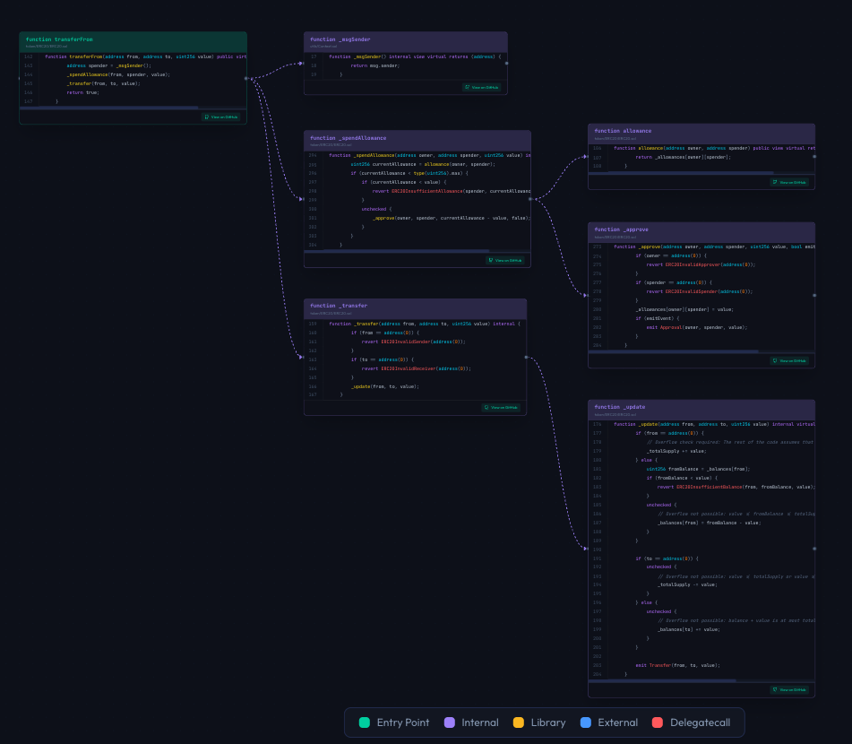

# Function Flow

Sol-Flow's Function Flow feature lets you visually see which functions a given function calls internally, which events it emits, and more. This guide explains how to read and use Function Flow.



## Opening Function Flow

To display Function Flow, click a function name within a contract node.


1. Find the contract node on the canvas
2. From the function list displayed in the node, click the function name you want to examine
3. The Function Flow dialog opens

### Function Flow Example

Below is an example of Function Flow for the `transferFrom` function.


## Function Flow Dialog Structure

The Function Flow dialog displays detailed information about the selected function.

### Basic Function Information

The header section of the dialog displays basic function information.

| Display Item | Description |
|--------------|-------------|
| Function Name | Name of the selected function (e.g., `transfer`) |
| Parent Contract | The contract where this function is defined |
| Visibility | `external`, `public`, `internal`, or `private` |
| State Mutability | `view` (reads state only), `pure` (computation only), `payable` (accepts ETH), `nonpayable` (default) |

### Parameters and Return Values

Function input parameters and return values are displayed.

| Item | Description |
|------|-------------|
| Parameters | Names and types of arguments passed to the function (e.g., `to: address`, `amount: uint256`) |
| Returns | Return value types (e.g., `bool`) |

## Reading the Call Flow

The central part of Function Flow visually displays what processing the selected function performs internally.

### Call Types

Function Flow displays different types of calls in different colors.

| Color | Call Type | Description |
|-------|-----------|-------------|
| Blue | Internal call | Calls another function in the same contract |
| Purple | Library call | Calls a library function (e.g., `SafeMath.add`) |
| Pink | External call | Calls a function on another contract |
| Orange | Super call | Calls the same-named function on a parent contract |
| Red | Delegatecall | Call using delegatecall |
| Green | Event emit | Events emitted with `emit` |
| Gray | Modifier | Modifiers applied to the function |

### Internal Call Example

```solidity
function transfer(address to, uint256 amount) public returns (bool) {
    _transfer(msg.sender, to, amount);  // Internal call -> displayed in blue
    return true;
}
```

The `transfer` function above internally calls the `_transfer` function. In Function Flow, this call is displayed as a blue node.

### Library Call Example

```solidity
using SafeMath for uint256;

function add(uint256 a, uint256 b) public pure returns (uint256) {
    return a.add(b);  // Library call -> displayed in purple
}
```

The `SafeMath.add` call is displayed as a purple node.

### Event Emit Example

```solidity
function transfer(address to, uint256 amount) public returns (bool) {
    // ... processing ...
    emit Transfer(msg.sender, to, amount);  // Event -> displayed in green
    return true;
}
```

Emitted events are displayed as green nodes.

## Modifier Display

You can also check modifiers applied to the function.

```solidity
function mint(address to, uint256 amount) public onlyOwner whenNotPaused {
    // onlyOwner and whenNotPaused are displayed as modifiers
}
```

Common modifier examples:

| Modifier | Role |
|----------|------|
| `onlyOwner` | Only owner can execute |
| `nonReentrant` | Prevents reentrancy attacks |
| `whenNotPaused` | Only executable when contract is not paused |
| `initializer` | Initialization function (for upgradeable contracts) |

## Source Code Display

The Function Flow dialog also displays the selected function's source code with syntax highlighting and line numbers.

## Usage Examples

### Understanding Code

Visually grasp the processing flow of complex functions.

| What You Can Check | Description |
|--------------------|-------------|
| Execution Order | Which functions are called in what order |
| Dependencies | Other functions needed for this function to work |
| Side Effects | Which events are emitted |

### Security Review

Identify potential security risks.

| Checkpoint | What to Check |
|------------|---------------|
| External calls | Risk of reentrancy attacks |
| Delegatecall | Delegation to untrusted contracts |
| Access control | Whether appropriate modifiers are applied |
| Events | Whether important operations emit events |

### Documentation Creation

Useful for explaining function behavior in audit reports or technical documentation.

## Jumping to Related Functions

Clicking on a displayed call target within Function Flow may jump to that function's details. This allows you to trace the call chain and understand the overall processing.

## Closing the Dialog

Use any of these methods to close the Function Flow dialog:

| Method | Operation |
|--------|-----------|
| X Button | Click the X button in the top right of the dialog |
| Escape Key | Press the `Escape` key |
| Click Outside | Click outside the dialog (dark background area) |

## Next Steps

- [Search](./08-search.md) - Search for specific functions for quick access
- [Edit Mode](./09-edit-mode.md) - Add custom relationships
