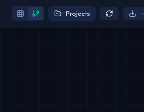
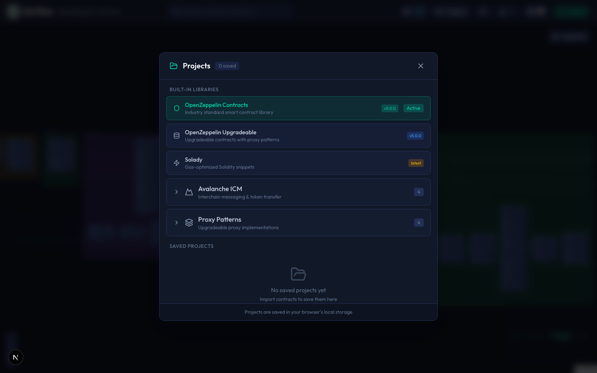

# Project Management

In Sol-Flow, you can save imported contracts and analysis results as "projects". This guide explains how to save, load, and manage projects.

## What is a Project?

A project is a collection of specific contracts and their analysis results. By saving a project, you can continue from where you left off the next time you open Sol-Flow.

### What Gets Saved in a Project

| Saved Item | Description |
|------------|-------------|
| Contracts | All imported contracts and their analysis results |
| Node Positions | Positions of nodes manually placed on the diagram |
| User Edges | Custom edges added in Edit Mode |
| View Settings | Category filters and layout settings |

### What Doesn't Get Saved

| Not Saved | Reason |
|-----------|--------|
| Original Source Files | Saved as analysis results (AST) instead |
| Temporary Edges | Designed as temporary notes |
| Selection State | Temporary UI state |

## Creating a Project

When you import contracts, a new project is automatically created.

1. Click the "Import" button in the header, or drag & drop files
2. Enter a project name in the import dialog (optional)
3. When import completes, it's saved as a project

### Naming Projects

Giving descriptive project names makes them easier to find later. Here are recommended naming patterns:

| Naming Pattern | Example |
|----------------|---------|
| Protocol name | `uniswap-v3`, `aave-v3` |
| Purpose + version | `token-audit-v2`, `nft-review-draft` |
| Date + description | `2024-01-security-audit` |

## Saving Projects

### Auto-Save

The following changes are automatically saved at the same time as the operation:

| Auto-Saved Operation | Timing |
|----------------------|--------|
| Moving nodes | When drag ends |
| Adding/deleting user edges | Immediately after operation |
| Changing category filters | Immediately after change |

No explicit save operation is required.

## Loading Projects

To open a saved project, click the button showing the project name (or library name) in the header.

This button shows the name of the currently displayed project or library (e.g., "OpenZeppelin Contracts").

### Project List Display

The project list displays the following information:

| Display Item | Description |
|--------------|-------------|
| Project Name | Name given at creation |
| Last Update | Date and time of last modification |
| Contract Count | Number of contracts in the project |

### Opening a Project

Clicking a project name in the project list loads that project and displays the diagram in its saved state.

## Managing Projects

### Renaming a Project

1. Open the project you want to rename
2. Edit the name from project settings
3. Changes are automatically saved

### Deleting a Project

1. Open the project list
2. Click the delete button (trash icon) on the project you want to delete
3. Select "Delete" in the confirmation dialog

**Note**: Deleted projects cannot be recovered. We recommend exporting important projects as images before deletion.

## Data Storage Location

Sol-Flow project data is stored in the browser's local storage.

### Local Storage Characteristics

| Characteristic | Description |
|----------------|-------------|
| Persistence | Data is retained even when closing the browser |
| Local storage | Data is stored only on your device, not sent to the cloud |
| Browser-specific | Projects saved in Chrome are not visible in Firefox |
| Size limit | Varies by browser, typically around 5-10MB |

### Clearing Data

Clearing Sol-Flow's site data from browser settings will delete all projects. Be careful when clearing browser history or cache.

## Limitations

### Storage Capacity

Projects with very many contracts or saving many projects may reach browser storage limits.

| Situation | Recommended Action |
|-----------|-------------------|
| Large number of contracts | Split into separate projects for related contracts |
| Many projects | Periodically delete unnecessary projects |

### Cross-Device Sharing

Since projects are stored in local storage, you cannot share projects between different devices or browsers. If sharing is needed, export the diagram as an image.

## Best Practices

### Project Organization

| Recommendation | Description |
|----------------|-------------|
| Separate by protocol | Group contracts related to one protocol in one project |
| Unified naming convention | Use consistent naming conventions for easy finding later |
| Regular cleanup | Delete completed work or unnecessary projects |

### Backup

We recommend exporting important diagrams as images and saving them externally. Even if browser data is lost, you can still reference the images.

## Next Steps

- [Export](./12-export.md) - How to export diagrams as images
- [Edit Mode](./09-edit-mode.md) - Enrich your project with custom edges
