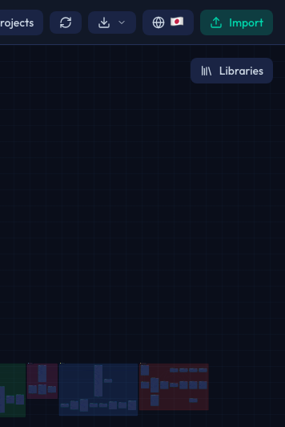
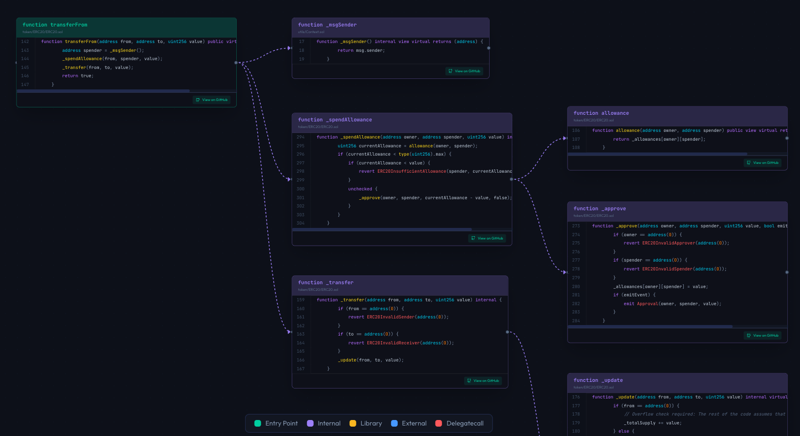

# はじめに

Sol-Flowへようこそ。このガイドでは、Sol-Flowの基本的な使い方を説明します。

## Sol-Flowとは

Sol-Flowは、Solidityスマートコントラクトの構造を視覚的に理解するためのツールです。

スマートコントラクトの開発や監査を行う際、コントラクト間の関係性を把握することは非常に重要です。Sol-Flowは、コントラクトをノード（箱）として表示し、それらの関係をエッジ（線）で結ぶことで、複雑なコントラクト構造を直感的に理解できるようにします。

### Sol-Flowでできること

| 機能 | 説明 |
|-----|------|
| 依存関係の可視化 | どのコントラクトがどのコントラクトを使用しているかを一目で確認できます |
| 継承階層の理解 | コントラクトの継承関係をツリー構造で把握できます |
| 関数呼び出しの追跡 | ある関数が内部でどの関数を呼び出しているかを追跡できます |
| プロキシパターンの検出 | UUPS、Transparent、ERC-7546などのプロキシパターンを自動で検出します |

## Sol-Flowを起動する

Sol-Flowを開くと、最初にランディングページが表示されます。

アプリケーションを使用するには、「始める」または「今すぐ始める」ボタンをクリックします。

## 画面構成

アプリに入ると、以下のようなメインインターフェースが表示されます。

### 各部の説明

| 部分 | 場所 | 役割 |
|-----|------|------|
| ヘッダー | 画面上部 | 検索、インポート、エクスポートなどの主要機能にアクセスできます |
| サイドバー | 画面左側 | インポートしたコントラクトの一覧や、組み込みライブラリを確認できます |
| キャンバス | 画面中央 | コントラクトの関係図が表示されるメインエリアです |
| ズームコントロール | 画面左下 | 表示の拡大・縮小や、全体表示への切り替えができます |

### ヘッダーの機能

ヘッダーには、よく使う機能がまとめられています。

| ボタン/機能 | 説明 |
|------------|------|
| ロゴ | クリックするとホーム画面に戻ります |
| 検索バー | コントラクト名、関数名、イベント名で検索できます。`Cmd+K`（Mac）または`Ctrl+K`（Windows）でも開けます |
| レイアウト切り替え | グリッド表示と階層表示を切り替えられます |
| Importボタン | Solidityファイルをインポートするダイアログを開きます |

### サイドバーの内容

サイドバーでは、現在表示されているコントラクトを管理できます。

| セクション | 説明 |
|-----------|------|
| プロジェクト構造 | インポートしたファイルのフォルダ構造を表示します |
| カテゴリ | コントラクトを種類別（Access Control、Financeなど）にフィルタリングできます |
| 凡例 | エッジの色と意味の対応を確認できます |
| 統計 | コントラクト数、ライブラリ数、関数数などの統計情報を表示します |

### キャンバスの操作

キャンバスでは、マウスやトラックパッドを使って自由に操作できます。

| 操作 | 方法 |
|-----|------|
| 移動 | キャンバスをドラッグするか、スクロールで上下左右に移動できます |
| ズーム | マウスホイール、またはトラックパッドのピンチ操作で拡大・縮小できます |
| ノードの展開 | コントラクトノードをクリックすると、関数の詳細が表示されます |

## 実際に使ってみる

### ステップ1: コントラクトをインポート

まず、分析したいSolidityファイル（`.sol`）をSol-Flowに読み込みます。

インポートする方法は2つあります。

1. **ドラッグ＆ドロップ**: ファイルを直接ブラウザウィンドウにドラッグして放します
2. **Importボタン**: ヘッダーの「Import」ボタンをクリックし、ファイル選択ダイアログからファイルを選びます

### ステップ2: 可視化を確認

インポートが完了すると、コントラクトがキャンバス上にノード（箱）として表示されます。

複数のコントラクトがある場合は、それぞれがノードとして表示され、関係性を示す線（エッジ）で結ばれます。

### ステップ3: ノードをクリックして詳細を確認

コントラクトノードをクリックすると、そのコントラクトが継承したり呼び出しているコントラクトの線が強調されます。

また、コントラクト内の関数名をクリックすると、その関数内で呼び出している別の関数を全て確認できます。

### ステップ4: 関係性を理解

コントラクト間を結ぶ線（エッジ）は、関係の種類によって色分けされています。

| 色 | 関係の種類 | 説明 |
|---|----------|------|
| 青 | 継承（inherits） | あるコントラクトが別のコントラクトを継承している関係 |
| 緑 | 使用（uses） | あるコントラクトが別のコントラクトを使用している関係 |
| 紫 | 実装（implements） | コントラクトがインターフェースを実装している関係 |
| ピンク | delegatecall | プロキシパターンで実装コントラクトを呼び出す関係 |

詳しい色の意味は、サイドバーの「Legend（凡例）」セクションで確認できます。

## 次のステップ

基本的な使い方が分かったら、以下のガイドでさらに詳しく学びましょう。

- [インポート](./02-import.md) - ファイルのインポート方法を詳しく学ぶ
- [ナビゲーション](./03-navigation.md) - キャンバス操作をマスターする
- [コントラクトノード](./04-contract-nodes.md) - ノードの見方を詳しく学ぶ
