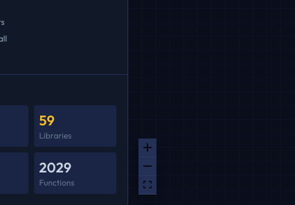
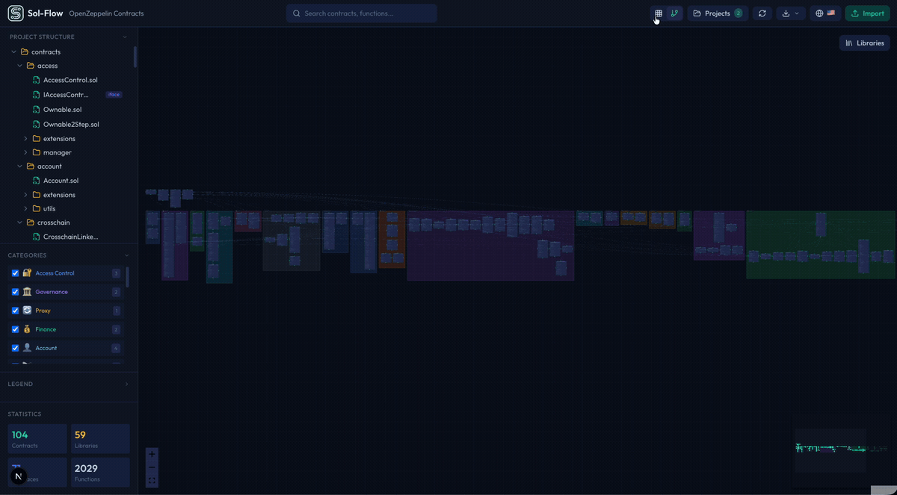

# ナビゲーション

Sol-Flowのキャンバスは、マウスやトラックパッドを使って自由に操作できます。このガイドでは、効率的にダイアグラムを閲覧するための操作方法を説明します。

## 基本操作

### 画面の移動

キャンバス上のダイアグラムを上下左右にスクロールして、画面外の部分を表示させることができます。


| 入力デバイス | 操作方法 |
|------------|---------|
| マウス | キャンバスの空白部分をドラッグ（クリックしたまま引っ張る） |
| トラックパッド | 2本指でスワイプ |
| タッチスクリーン | 1本指でスワイプ |

### ズーム（拡大・縮小）

ダイアグラムを拡大または縮小するには、以下の方法を使います。

| 入力デバイス | 操作方法 |
|------------|---------|
| マウス | マウスホイールを回転（上で拡大、下で縮小） |
| トラックパッド | ピンチ操作（2本指を広げて拡大、狭めて縮小） |
| ツールバー | 画面左下の「+」「-」ボタンをクリック |



ズームの中心は、マウスカーソルの位置になります。見たい部分にカーソルを置いてからズームすると、その部分を中心に拡大できます。

### 全体を表示（フィットビュー）

ダイアグラム全体を画面に収めて表示するには、ツールバーの「Fit」ボタン（四角形のアイコン）をクリックします。これにより、すべてのノードが見えるようにズームレベルと位置が自動調整されます。

この機能は、ダイアグラムを見失ったときや、全体像を確認したいときに便利です。

## ツールバーの機能

キャンバスの左下にあるツールバーには、以下のボタンがあります。

| ボタン | アイコン | 機能 |
|-------|---------|------|
| ズームイン | + | ダイアグラムを拡大します |
| ズームアウト | - | ダイアグラムを縮小します |
| フィット | ⛶ | すべてのノードが見えるように表示を調整します |

## ノードの移動

### ノードの位置を変更する

個々のコントラクトノードは、ドラッグして好きな位置に移動できます。


1. 移動したいノードにマウスカーソルを合わせます
2. マウスの左ボタンを押し下げます
3. ボタンを押したまま、移動先までドラッグします
4. 目的の位置でボタンを離します

ノードの位置は自動的に保存されます。ページを再読み込みしても、配置した位置が維持されます。

### 効果的な配置のコツ

ダイアグラムを見やすく整理するためのヒントです。

| コツ | 説明 |
|-----|------|
| 関連ノードを近くに | 継承関係にあるコントラクトや、よく一緒に使うコントラクトは近くに配置すると見やすくなります |
| 階層を意識 | 親コントラクトを上に、子コントラクトを下に配置すると、継承関係が分かりやすくなります |
| 空間を活用 | ノード同士が重ならないよう、適度な間隔を空けて配置しましょう |

## レイアウトの切り替え

Sol-Flowでは、ダイアグラムのレイアウトを切り替えることができます。

### グリッドレイアウト

ノードを格子状に配置します。多数のコントラクトがある場合に全体を把握しやすくなります。

```
[Contract A] [Contract B] [Contract C]
[Contract D] [Contract E] [Contract F]
[Contract G] [Contract H] [Contract I]
```

### 階層レイアウト

継承関係に基づいて、親コントラクトを上に、子コントラクトを下に配置します。継承構造を理解しやすくなります。

```
        [Base Contract]
             ↓
    [Intermediate Contract]
         ↓         ↓
[Contract A]  [Contract B]
```

### 切り替え方法

ヘッダーにあるレイアウト切り替えボタンをクリックして、レイアウトを切り替えます。



ヘッダー中央付近にある2つのアイコンがレイアウト切り替えボタンです。

| アイコン | レイアウト | 説明 |
|---------|----------|------|
| 格子状（4つの四角） | グリッド | ノードを格子状に配置 |
| 分岐線（ツリー形状） | 階層 | 継承関係に基づいて階層的に配置 |

## キーボードショートカット

効率的に操作するためのキーボードショートカットです。

| ショートカット | 機能 |
|--------------|------|
| `Cmd + K` (Mac) / `Ctrl + K` (Windows) | 検索バーを開く |
| `Escape` | モーダルやドロップダウンを閉じる |

## 大きなダイアグラムでの作業

コントラクト数が多い場合、以下のテクニックが役立ちます。

### 検索機能を活用

目的のコントラクトを探すために画面をスクロールする代わりに、検索機能（`Cmd + K`）を使えば、コントラクト名を入力するだけで瞬時にそのコントラクトまで移動できます。

### カテゴリでフィルタリング

サイドバーのカテゴリチェックボックスを使って、表示するコントラクトの種類を絞り込めます。例えば、Access Controlカテゴリだけにチェックを入れると、アクセス制御関連のコントラクトだけが表示されます。

### フィットビューで全体確認

作業中に迷子になったら、「Fit」ボタンをクリックして全体を表示し、現在地を確認しましょう。

## トラブルシューティング

### ノードが見つからない

| 症状 | 対処法 |
|-----|-------|
| ダイアグラムが画面外 | 「Fit」ボタンをクリックして全体を表示 |
| 特定のコントラクトを探している | 検索機能を使ってコントラクト名で検索 |
| カテゴリでフィルタされている | サイドバーのカテゴリチェックボックスを確認 |

### ズームが効かない

| 症状 | 対処法 |
|-----|-------|
| マウスホイールが反応しない | マウスカーソルがキャンバス上にあることを確認 |
| ブラウザごとズームされてしまう | ブラウザのズーム設定を100%に戻す（`Cmd + 0` / `Ctrl + 0`） |

## 次のステップ

- [コントラクトノード](./04-contract-nodes.md) - ノードの見方と操作方法を詳しく学ぶ
- [リレーションシップ](./05-relationships.md) - エッジ（線）の意味を理解する
