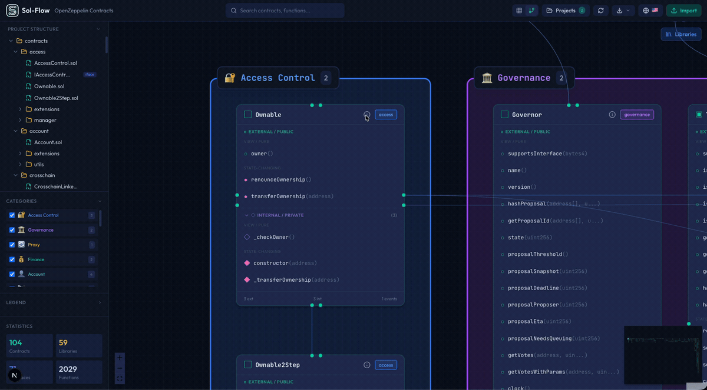
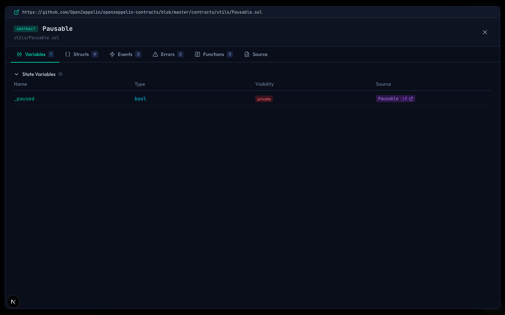
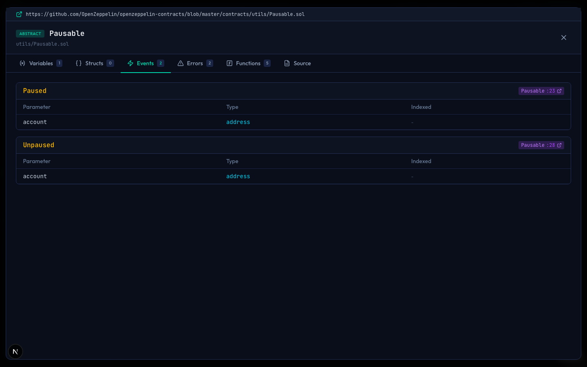
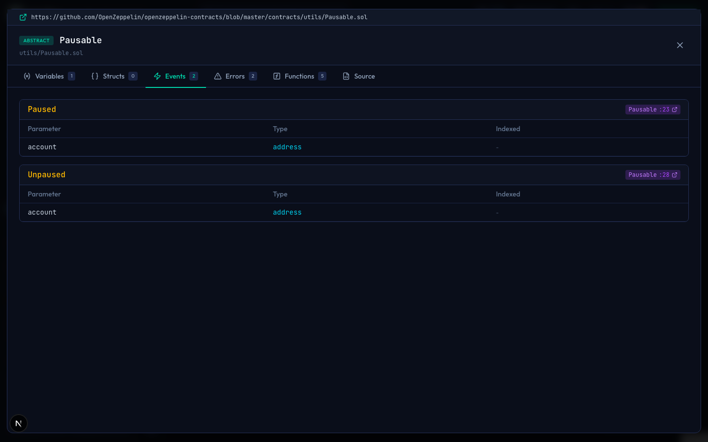
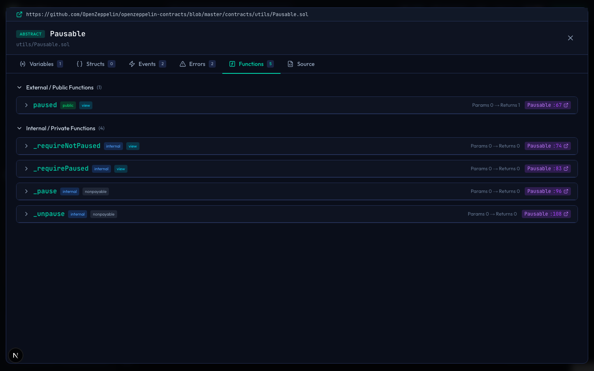
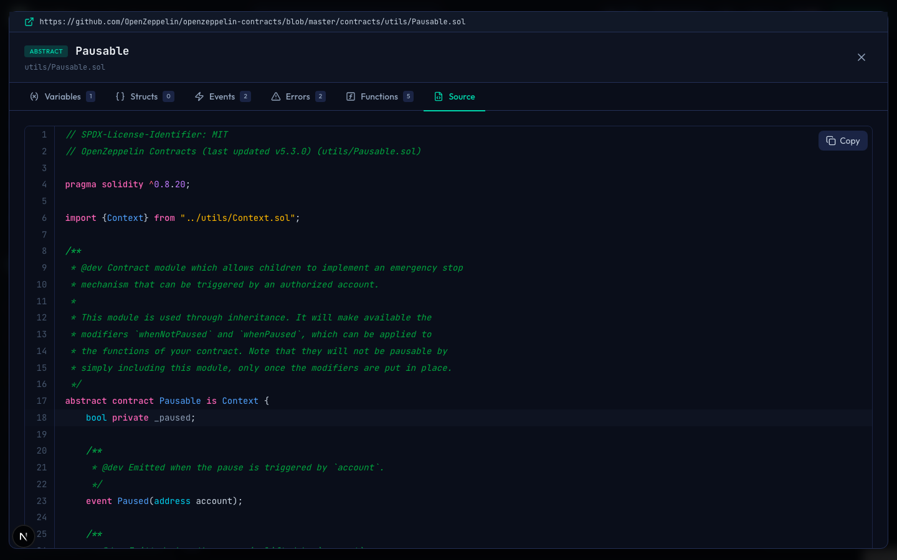

# コントラクト詳細

Sol-Flowでは、コントラクトノードの詳細ボタン（ℹ️）をクリックすると、そのコントラクトの完全な情報を表示する「コントラクト詳細モーダル」が開きます。このガイドでは、詳細モーダルの使い方を説明します。

## 詳細モーダルを開く

コントラクト詳細モーダルを開くには、以下のいずれかの方法を使います。

| 方法 | 操作 |
|-----|------|
| キャンバスのノードから | ノードのヘッダーにある詳細ボタン（ℹ️アイコン）をクリック |
| サイドバーから | サイドバーのコントラクト名にマウスを合わせ、表示されるアイコンをクリック |

サイドバーからもアクセスできます。

## モーダルの構成

コントラクト詳細モーダルは、複数のタブで構成されています。タブをクリックして、表示する情報を切り替えることができます。

### ヘッダー部分

モーダルの上部には、以下の情報が表示されます。

| 表示項目 | 説明 |
|---------|------|
| GitHub リンク | クリックすると、元のソースコードのGitHubページ（利用可能な場合）を開きます |
| コントラクト種類 | CONTRACT、INTERFACE、LIBRARY、ABSTRACTのいずれかのバッジ |
| コントラクト名 | コントラクトの名前 |
| ファイルパス | ソースファイルの場所 |

## タブの種類

### Variables（状態変数）タブ

コントラクトで定義されている状態変数の一覧を表示します。

| 表示項目 | 説明 |
|---------|------|
| Name | 変数の名前 |
| Type | 変数の型（`uint256`、`address`、`mapping(...)` など） |
| Visibility | 可視性（`public`、`private`、`internal`） |
| Source | ソースコード上の定義位置（行番号付きリンク） |

`constant`や`immutable`で修飾された変数には、特別なバッジが表示されます。

### Structs（構造体）タブ

コントラクトで定義されている構造体の一覧を表示します。

### Events（イベント）タブ

コントラクトで定義されているイベントの一覧を表示します。各イベントについて、パラメータとその型、`indexed`属性の有無が確認できます。

### Errors（エラー）タブ

コントラクトで定義されているカスタムエラーの一覧を表示します。Solidity 0.8.4以降で導入されたカスタムエラーを確認できます。

### Functions（関数）タブ

コントラクトの全関数を一覧表示します。各関数について、以下の情報が確認できます。

| 表示項目 | 説明 |
|---------|------|
| 関数名 | 関数の名前とシグネチャ |
| 可視性 | `external`、`public`、`internal`、`private` |
| 状態変更性 | `view`（読み取り専用）、`pure`（計算のみ）、`payable`（ETH受付可能）など |
| パラメータ | 入力パラメータと型 |
| 戻り値 | 戻り値と型 |
| モディファイア | 適用されているモディファイア（`onlyOwner`など） |

### Source（ソースコード）タブ

コントラクトの完全なソースコードを表示します。

ソースコードビューアーには、以下の機能があります。

| 機能 | 説明 |
|-----|------|
| シンタックスハイライト | Solidityのキーワード、型、コメントなどが色分けされて表示されます |
| 行番号 | 各行に行番号が表示され、特定の場所を参照しやすくなっています |
| コピーボタン | ソースコード全体をクリップボードにコピーできます |

### シンタックスハイライトの色分け

ソースコードは以下のように色分けされます。

| 要素 | 色 | 例 |
|-----|---|---|
| キーワード | 紫 | `contract`、`function`、`if`、`return` |
| 型 | 青 | `uint256`、`address`、`bool`、`string` |
| 組み込み変数/関数 | シアン | `msg.sender`、`block.timestamp`、`require` |
| 文字列 | 緑 | `"Hello World"` |
| コメント | グレー | `// comment`、`/* comment */` |
| NatSpecドキュメント | グレー斜体 | `/// @notice`、`/** @dev */` |
| 数値 | オレンジ | `100`、`0x1234` |

## モーダルを閉じる

モーダルを閉じるには、以下のいずれかの方法を使います。

| 方法 | 操作 |
|-----|------|
| Xボタン | モーダル右上の✕ボタンをクリック |
| Escapeキー | キーボードの`Escape`キーを押す |
| 外側をクリック | モーダルの外側（暗い背景部分）をクリック |

## 活用方法

### コードレビュー

監査やレビューの際に、コントラクトの詳細を確認できます。

| 目的 | 確認するタブ |
|-----|------------|
| 状態変数の確認 | Variables |
| 関数のシグネチャ確認 | Functions |
| イベントの確認 | Events |
| 実装の詳細確認 | Source |

### コントラクトの比較

複数のブラウザタブを開いて、異なるコントラクトの詳細を並べて比較することができます。例えば、OpenZeppelinのERC20とSolmateのERC20を比較する際に便利です。

### ソースコードのコピー

Sourceタブのコピーボタンを使うと、コントラクトの完全なソースコードをクリップボードにコピーできます。ドキュメントの作成やレポートの執筆に便利です。

## 次のステップ

- [関数フロー](./07-function-flow.md) - 関数の呼び出し関係を詳しく分析する
- [検索](./08-search.md) - 特定の関数やイベントを検索する
