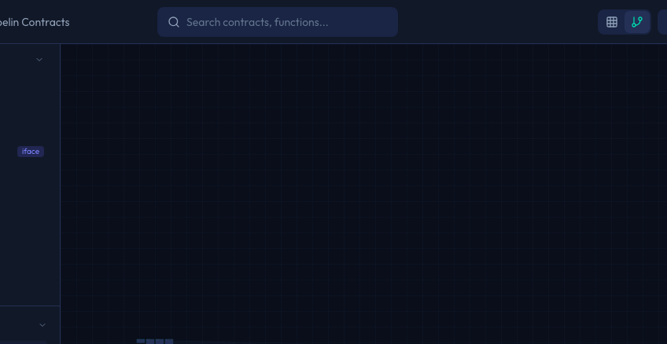
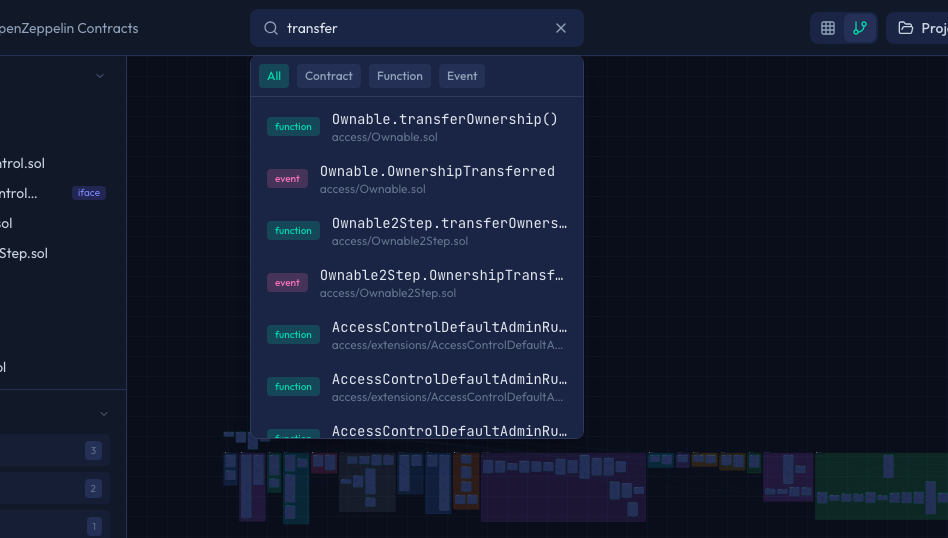

# 検索

Sol-Flowの検索機能を使うと、多数のコントラクトの中から目的のコントラクト、関数、イベントをすばやく見つけることができます。

## 検索バーを開く

検索バーは画面上部のヘッダーにあります。

検索バーを開くには、以下のいずれかの方法を使います。

| 方法 | 操作 |
|-----|------|
| クリック | ヘッダーの検索バーを直接クリックします |
| キーボードショートカット | `Cmd + K`（Mac）または `Ctrl + K`（Windows/Linux）を押します |

キーボードショートカットを覚えておくと、マウスを動かさずにすばやく検索を開始できるので便利です。

## 検索の仕組み

### リアルタイム検索

Sol-Flowの検索は、文字を入力するとリアルタイムで結果が表示されます。検索ボタンを押す必要はありません。

例えば「trans」と入力すると、「transfer」「transferFrom」「_transfer」など、「trans」を含むすべての項目が即座に表示されます。

### 検索できる項目

検索では、以下の3種類の項目を探すことができます。

| 種類 | 説明 | 検索例 |
|-----|------|-------|
| コントラクト名 | インポートされているコントラクトの名前 | `ERC20`、`Ownable`、`AccessControl` |
| 関数名 | コントラクト内の関数の名前 | `transfer`、`approve`、`balanceOf` |
| イベント名 | コントラクトで定義されているイベントの名前 | `Transfer`、`Approval`、`OwnershipTransferred` |

### 検索結果のグループ分け

検索結果は、種類ごとに分類されて表示されます。それぞれの結果には、種類を示すアイコンと、関数やイベントの場合はそれが属するコントラクト名も表示されます。

| 結果の種類 | 表示される情報 |
|-----------|---------------|
| コントラクト | コントラクト名とカテゴリバッジ |
| 関数 | 関数名と、その関数が定義されているコントラクト名 |
| イベント | イベント名と、そのイベントが定義されているコントラクト名 |

## 検索結果の使い方

### 結果をクリックして移動

検索結果の項目をクリックすると、以下の動作が行われます。

1. 検索ドロップダウンが閉じます
2. キャンバス上で、該当するコントラクトまで自動的に移動します
3. 画面の中央にそのコントラクトが表示されるようにズームが調整されます

この機能を使えば、大きなダイアグラムの中でも目的のコントラクトをすぐに見つけることができます。

### 検索のキャンセル

検索をキャンセルして結果を閉じるには、以下のいずれかの方法を使います。

| 方法 | 操作 |
|-----|------|
| Escapeキー | キーボードの`Escape`キーを押します |
| 外側をクリック | 検索ドロップダウンの外側をクリックします |
| テキストをクリア | 検索バーの文字を全て削除します |

## 検索のコツ

### 部分一致で検索

検索は部分一致で行われます。つまり、名前の一部を入力するだけで、その文字列を含むすべての項目が見つかります。

| 入力 | 見つかる例 |
|-----|----------|
| `trans` | `transfer`、`transferFrom`、`_transfer`、`safeTransferFrom` |
| `ERC` | `ERC20`、`ERC721`、`ERC1155`、`ERC20Burnable` |
| `owner` | `owner`、`onlyOwner`、`_checkOwner`、`OwnershipTransferred` |

### 大文字・小文字を区別しない

検索は大文字・小文字を区別しません。どちらで入力しても同じ結果が得られます。

| 入力 | 結果 |
|-----|------|
| `ownable` | `Ownable`が見つかります |
| `OWNABLE` | `Ownable`が見つかります |
| `Ownable` | `Ownable`が見つかります |

### よく使う検索キーワード

用途に応じて、以下のようなキーワードで検索すると効率的です。

**トークン関連の機能を探す場合**
- `transfer` - トークン送付関連の関数
- `approve` - 承認関連の関数
- `balance` - 残高確認関連の関数
- `mint` - トークン発行関連の関数
- `burn` - トークン焼却関連の関数

**アクセス制御を探す場合**
- `owner` - オーナー関連の関数
- `role` - ロールベースのアクセス制御
- `access` - アクセス制御関連の機能

**インターフェースを探す場合**
- `IERC20` - ERC20のインターフェース
- `IERC721` - ERC721（NFT）のインターフェース
- `IAccess` - アクセス制御のインターフェース

## モバイルでの検索

スマートフォンやタブレットでSol-Flowを使う場合、検索の手順は少し異なります。

1. ヘッダーにある検索アイコン（虫眼鏡のマーク）をタップします
2. 表示された検索バーに検索キーワードを入力します
3. 検索結果が表示されたら、目的の項目をタップして移動します

## 効率的な使い方のヒント

検索機能を効果的に使うためのヒントを紹介します。

| ヒント | 説明 |
|-------|------|
| ナビゲーションとして使う | ダイアグラムをスクロールして探す代わりに、検索でコントラクト名を入力すれば一発で移動できます |
| 完全な名前を入力 | 特定のコントラクトを探す場合は、完全な名前を入力すると結果が絞り込まれます |
| サイドバーと併用 | 大まかなカテゴリはサイドバーで絞り込み、詳細は検索で探すと効率的です |
| ズームと組み合わせ | 検索で移動した後、マウスホイールでズームを調整すると見やすくなります |

## 次のステップ

- [編集モード](./09-edit-mode.md) - コントラクト間にカスタム関係を追加する方法
- [プロジェクト管理](./11-project-management.md) - 作業内容を保存・管理する方法
