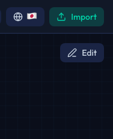
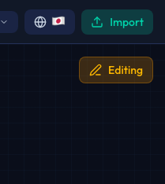

# 編集モード

Sol-Flowは、コードを静的解析することでコントラクト間の関係を自動的に検出します。しかし、動的な呼び出しや設定ファイルで定義された関係など、静的解析では検出できない関係もあります。編集モードを使うと、そのような関係を手動で追加できます。

## 編集モードとは

編集モードは、コントラクト間にカスタムのエッジ（関係線）を追加するための機能です。以下のような場面で役立ちます。

| ユースケース | 説明 |
|------------|------|
| プロキシ関係の文書化 | プロキシと実装コントラクトの関係が自動検出されない場合 |
| 動的な相互作用の表示 | コンストラクタや設定関数でアドレスが設定される場合 |
| アーキテクチャの説明 | 技術ドキュメントや監査レポート用にダイアグラムを補完する場合 |

## 編集モードを有効にする

編集モードは、保存されたプロジェクトでのみ使用できます。組み込みライブラリの表示中は使用できません。



### 有効化の手順

1. コントラクトをインポートするか、保存済みのプロジェクトを開きます
2. ヘッダー右側にある「Edit」ボタンをクリックします
3. ボタンがオレンジ色に変わり、「Editing」と表示されたら編集モードが有効です



### 無効化の手順

編集モードを終了するには、再度「Edit」ボタンをクリックします。

## エッジの種類

Sol-Flowでは、2種類のカスタムエッジを追加できます。

### 一時エッジ（Temporary Edge）

| 特徴 | 説明 |
|-----|------|
| 色 | 赤い破線 |
| 保存 | 保存されない（ページをリロードすると消える） |
| 作成条件 | 編集モードがオフの場合、または組み込みライブラリを表示中の場合 |
| 用途 | 一時的なメモや、関係を試しに確認したい場合 |

### ユーザーエッジ（User Edge）

| 特徴 | 説明 |
|-----|------|
| 色 | シアン（水色） |
| 保存 | プロジェクトに保存される |
| 作成条件 | 編集モードがオンの場合 |
| 用途 | 永続的に記録したい関係 |

## エッジの追加方法


### 基本的な操作

1. ソースとなるコントラクトノード（関係の起点）を見つけます
2. そのノードをクリックしたまま、ターゲットとなるコントラクトノード（関係の終点）までドラッグします
3. ターゲットノード上でマウスボタンを離すと、エッジが作成されます

### 一時エッジを作成する

編集モードがオフの状態、または組み込みライブラリを表示中にドラッグ操作を行うと、一時エッジが作成されます。一時エッジは探索や確認に便利ですが、ページを更新すると消えます。

### ユーザーエッジを作成する

編集モードをオンにした状態でドラッグ操作を行うと、ユーザーエッジが作成されます。ユーザーエッジはプロジェクトに保存され、次回プロジェクトを開いたときも表示されます。

## エッジの削除

### 一時エッジの削除

一時エッジにマウスカーソルを合わせると、削除ボタン（×アイコン）が表示されます。このボタンをクリックするとエッジが削除されます。

また、ページをリロードすると、すべての一時エッジが一度に削除されます。

### ユーザーエッジの削除

ユーザーエッジも同様に、マウスを合わせて削除ボタンをクリックすることで削除できます。削除は即座にプロジェクトに保存されます。

## 活用例

### プロキシパターンの文書化

プロキシコントラクトと実装コントラクトの関係が自動検出されない場合、手動でdelegatecall関係を追加できます。

```
MyProxy ──delegatecall──> MyImplementationV1
```

### DeFiプロトコルのアーキテクチャ

ルーターコントラクトが複数のトークンコントラクトを呼び出す関係を表現できます。

```
Router ──uses──> TokenA
Router ──uses──> TokenB
Router ──uses──> LiquidityPool
```

### 監査ドキュメント

セキュリティ監査の際に、コントラクト間の重要な相互作用を明示的に示すことができます。

## ベストプラクティス

### 控えめに使用する

カスタムエッジは、静的解析で検出できない関係にのみ使用することをお勧めします。自動検出される関係と重複してエッジを追加すると、ダイアグラムが煩雑になります。

### 定期的に見直す

コードが変更されると、手動で追加したエッジが実際の関係と一致しなくなることがあります。プロジェクトのコードを更新した際は、カスタムエッジも見直しましょう。

### 意図を明確に

エッジを追加する際は、なぜその関係が存在するのかを理解した上で追加しましょう。技術ドキュメントやコメントで補足説明を残しておくと、後から見返したときに役立ちます。

## 保存について

ユーザーエッジは、プロジェクトの一部として自動的に保存されます。明示的な保存操作は必要ありません。

## 次のステップ

- [プロキシパターン](./10-proxy-patterns.md) - 自動検出されるプロキシパターンについて学ぶ
- [エクスポート](./12-export.md) - 編集したダイアグラムを画像としてエクスポートする
