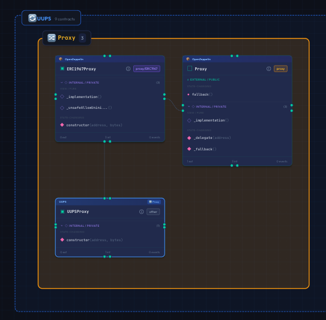
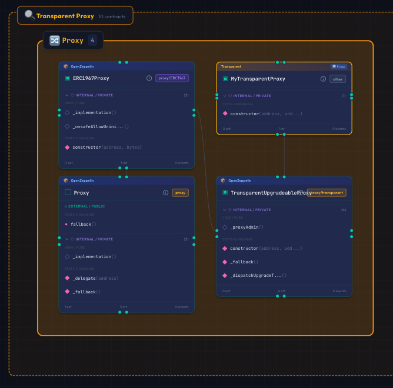
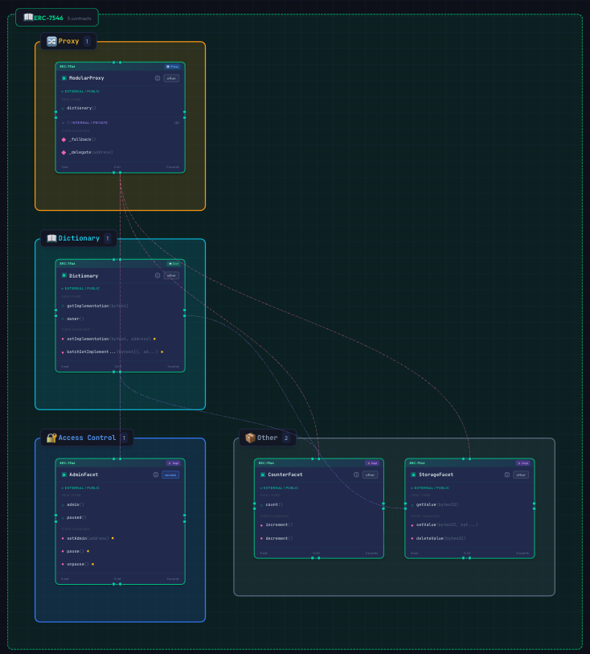
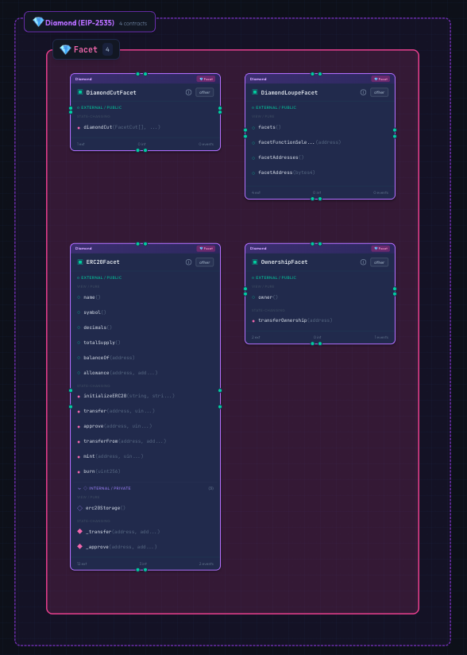
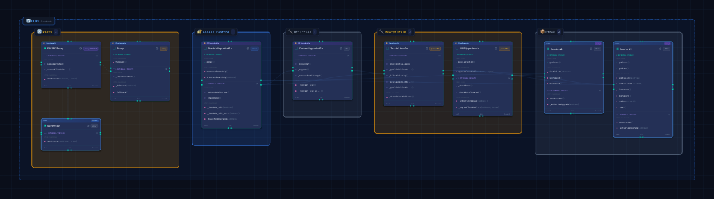
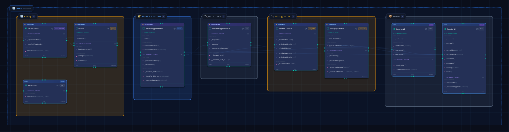

# プロキシパターン

Sol-Flowは、Ethereumのスマートコントラクトで使用される主要なプロキシパターンを自動的に検出し、視覚的に表現します。このガイドでは、各プロキシパターンの概要とSol-Flowでの表示方法を説明します。

## プロキシパターンとは

プロキシパターンは、スマートコントラクトをアップグレード可能にするための設計パターンです。Ethereumのコントラクトは一度デプロイすると変更できないため、プロキシパターンを使って「ロジックの更新」を実現します。

基本的な仕組みは以下の通りです。

| コンポーネント | 役割 |
|--------------|------|
| プロキシコントラクト | ユーザーからの呼び出しを受け付け、実装コントラクトに転送する。ストレージ（データ）を保持する |
| 実装コントラクト | 実際のビジネスロジックを持つ。アップグレード時に新しい実装に差し替えられる |

プロキシは`delegatecall`を使用して、実装コントラクトのコードをプロキシのコンテキスト（ストレージ）で実行します。

## 対応しているプロキシパターン

Sol-Flowは以下のプロキシパターンを自動検出します。

### ERC-1967（Transparent / UUPS）

最も広く使用されているプロキシ標準です。実装アドレスやadminアドレスを特定のストレージスロットに保存します。

- **UUPS**



- **Transparent**



```solidity
// ERC-1967で定義されるストレージスロット
bytes32 constant IMPLEMENTATION_SLOT = 0x360894a13ba1a3210667c828492db98dca3e2076cc3735a920a3ca505d382bbc;
bytes32 constant ADMIN_SLOT = 0xb53127684a568b3173ae13b9f8a6016e243e63b6e8ee1178d6a717850b5d6103;
```

| 項目 | 説明 |
|-----|------|
| 検出方法 | ERC-1967で定義されたストレージスロット定数の使用を検出 |
| 表示バッジ | 「UUPS」または「Transparent」 |
| 役割バッジ | 「🔀 Proxy」「⚡ Impl」 |

### ERC-7546（モジュラープロキシ）

関数ごとに異なる実装コントラクトを呼び出せる、より柔軟なプロキシパターンです。



```solidity
interface IDictionary {
    function getImplementation(bytes4 selector) external view returns (address);
}
```

| コンポーネント | 役割 |
|--------------|------|
| Proxy | ユーザーからの呼び出しを受け、辞書に問い合わせて適切な実装に転送する |
| Dictionary | 関数セレクタと実装アドレスのマッピングを管理する |
| Implementation | 特定の関数群を実装するコントラクト（複数存在可能） |

| 項目 | 説明 |
|-----|------|
| 検出方法 | IDictionaryインターフェースの実装やgetImplementation関数の存在を検出 |
| 表示バッジ | 「ERC-7546」 |
| 役割バッジ | 「📖 Dict」「🔀 Proxy」「⚡ Impl」 |

### ERC-2535（Diamond）

複数の「ファセット」コントラクトから機能を集約するパターンです。ERC-7546と似ていますが、より複雑な構造を持ちます。



```solidity
struct Facet {
    address facetAddress;
    bytes4[] functionSelectors;
}
```

| 項目 | 説明 |
|-----|------|
| 検出方法 | Diamondストレージパターンやファセット構造の検出 |
| 表示バッジ | 「Diamond」 |
| 役割バッジ | 「💎 Facet」 |

### Beacon Proxy

複数のプロキシが共通の実装を参照するパターンです。Beaconコントラクトが実装アドレスを管理し、すべてのプロキシがそれを参照します。

```solidity
interface IBeacon {
    function implementation() external view returns (address);
}
```

| 項目 | 説明 |
|-----|------|
| 検出方法 | IBeaconインターフェースの実装を検出 |
| 表示バッジ | 「Beacon」 |
| 役割バッジ | 「📡 Beacon」 |

## Sol-Flowでの表示

### ノードの表示

プロキシパターンを使用しているコントラクトには、特別なバッジが表示されます。



バッジ部分を拡大すると以下のように表示されます。



| 表示場所 | 内容 |
|---------|------|
| ノード上部 | パターン名（「ERC-7546」「UUPS」など） |
| ノード上部（右側） | 役割バッジ（「🔀 Proxy」「⚡ Impl」など） |
| ノード枠線 | パターンに応じた色（ERC-7546は緑、UUPSは青など） |

### エッジの表示

プロキシ関連のエッジは、ピンク色の破線で表示されます。

| エッジ | 表示 | 意味 |
|-------|-----|------|
| delegatecall | ピンクの破線 | プロキシから実装へのdelegatecall関係 |
| registers | バイオレットの破線 | 辞書への実装の登録（ERC-7546） |

### ERC-7546のレイアウト例

ERC-7546パターンでは、以下のような階層構造が表示されます。

```
           ┌─────────────┐
           │   Proxy     │  ← ユーザーがアクセスするエントリーポイント
           └──────┬──────┘
                  │
           ┌──────▼──────┐
           │ Dictionary  │  ← 関数セレクタ → 実装のマッピング
           └──────┬──────┘
                  │
    ┌─────────────┼─────────────┐
    ▼             ▼             ▼
┌───────┐   ┌───────┐   ┌───────┐
│ Impl1 │   │ Impl2 │   │ Impl3 │  ← 各機能の実装
└───────┘   └───────┘   └───────┘
```

## 活用方法

### アップグレード分析

プロキシパターンを理解することで、以下のことが分析できます。

| 確認項目 | 説明 |
|---------|------|
| 現在の実装 | どのコントラクトが実際のロジックを持っているか |
| ストレージ互換性 | アップグレード時にストレージレイアウトが互換性を保っているか |
| 管理者アクセス | 誰がアップグレードを実行できるか |

### セキュリティレビュー

プロキシパターンに関連するセキュリティリスクをチェックできます。

| チェック項目 | 潜在的なリスク |
|------------|---------------|
| 初期化されていないプロキシ | 誰でもinitialize関数を呼び出せる可能性 |
| アクセス制御の欠如 | 不正なアップグレードが可能になる可能性 |
| ストレージの衝突 | 異なるコントラクト間でストレージが上書きされる可能性 |

### アーキテクチャドキュメント

プロキシアーキテクチャを可視化することで、以下の用途に活用できます。

| 用途 | 説明 |
|-----|------|
| 開発者オンボーディング | 新しいチームメンバーにシステム構造を説明 |
| 監査準備 | セキュリティ監査者への資料として使用 |
| 技術仕様書 | プロトコルの技術ドキュメントに含める |

## 組み込みライブラリ

Sol-Flowには、プロキシパターンのリファレンス実装が組み込まれています。

| ライブラリ | 含まれるパターン |
|-----------|----------------|
| OpenZeppelin | ERC-1967、Beacon、Transparent、UUPS |
| ERC-7546 | モジュラープロキシのリファレンス実装 |

サイドバーの「Libraries」ボタンからこれらの実装を確認できます。

## 次のステップ

- [プロジェクト管理](./11-project-management.md) - プロキシ分析結果を保存する
- [エクスポート](./12-export.md) - プロキシダイアグラムを画像としてエクスポートする
