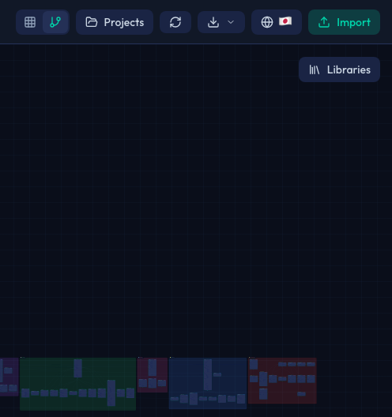
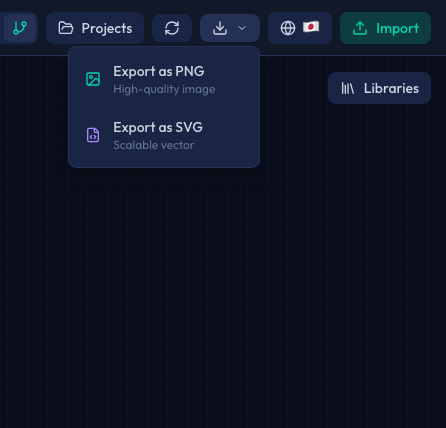

# エクスポート

Sol-Flowで作成したダイアグラムを画像としてエクスポートする方法を説明します。エクスポートした画像は、ドキュメント、プレゼンテーション、監査レポートなどに活用できます。

## エクスポート機能

Sol-Flowでは、現在表示しているダイアグラムをPNG画像としてエクスポートできます。



## エクスポートの手順

### 1. ダイアグラムを準備する

エクスポートする前に、ダイアグラムを見やすく整理しましょう。

| 準備項目 | 説明 |
|---------|------|
| ノードの配置 | 関連するノードを近くに配置し、見やすいレイアウトにする |
| ズームレベル | 全体が見えるようにズームを調整する（フィットビューが便利） |
| 折りたたみ | 不要な詳細は折りたたんで、重要な部分を強調する |

### 2. エクスポートを実行する

1. ヘッダーにあるエクスポートボタン（↓アイコン）をクリックします
2. エクスポートオプションが表示されます



3. 「Export as PNG」または「Export as SVG」を選択します
4. 画像ファイルが自動的にダウンロードされます

## エクスポート設定

エクスポート時に、いくつかの設定を変更できます。

| 設定項目 | オプション | 説明 |
|---------|----------|------|
| 背景色 | 透明、白、ダーク | 用途に応じて背景色を選択 |
| 品質 | 標準、高 | 画像の解像度を選択 |
| 範囲 | すべて、表示中のみ | エクスポートする範囲を選択 |

### 背景色の選び方

| 背景色 | おすすめの用途 |
|-------|--------------|
| 透明 | 他の画像やドキュメントに重ねる場合 |
| 白 | 印刷物やライトモードのドキュメントに使用する場合 |
| ダーク | プレゼンテーションやダークモードのドキュメントに使用する場合 |

## 画像の解像度

エクスポートされる画像の解像度は、現在のビューに基づいて決まります。

| 要素 | 解像度への影響 |
|-----|--------------|
| ズームレベル | 高いズームレベルでエクスポートすると、詳細が見やすくなります |
| 表示範囲 | 表示しているノードの数によって画像サイズが変わります |

高解像度の画像が必要な場合は、エクスポート前にズームインしてから実行してください。

## ファイル名

エクスポートされるファイルの名前は、以下のパターンで自動生成されます。

```
sol-flow-[プロジェクト名]-[日付].png
```

例: `sol-flow-my-protocol-2024-01-15.png`

## 活用シーン

### 技術ドキュメント

エクスポートした画像をREADMEファイルやWikiに含めることで、コントラクト構造を視覚的に説明できます。

| 用途 | 説明 |
|-----|------|
| README | プロジェクトのアーキテクチャ概要を示す |
| 技術仕様書 | コントラクト間の関係を詳しく説明する |
| APIドキュメント | 外部開発者向けにシステム構造を示す |

### プレゼンテーション

チームミーティングやコードレビューでのプレゼンテーションに活用できます。

| シーン | 活用方法 |
|-------|---------|
| 設計レビュー | 新機能のアーキテクチャを説明する |
| コードレビュー | 変更箇所の影響範囲を視覚的に示す |
| チームミーティング | プロジェクトの進捗や構造を共有する |

### 監査レポート

セキュリティ監査の際に、コントラクト構造を文書化できます。

| 用途 | 説明 |
|-----|------|
| スコープの定義 | 監査対象のコントラクトを明示する |
| 依存関係の説明 | コントラクト間の関係を視覚的に示す |
| プロキシ構造 | アップグレード可能なコントラクトの構造を説明する |

### SNSやブログでの共有

作成したダイアグラムを共有して、プロジェクトの宣伝やコミュニティへの貢献に活用できます。

| プラットフォーム | 活用例 |
|----------------|-------|
| Twitter/X | 新機能のアーキテクチャを紹介 |
| ブログ記事 | 技術解説記事に図を含める |
| Discord/Telegram | コミュニティでの議論に使用 |

## エクスポート前のチェックリスト

高品質な画像をエクスポートするためのチェックリストです。

| チェック項目 | 確認内容 |
|------------|---------|
| レイアウト | ノードが見やすく配置されているか |
| ズーム | 必要な詳細が見える適切なズームレベルか |
| フォーカス | 重要な部分が画面の中央にあるか |
| フィルタ | 不要なカテゴリが非表示になっているか |

## 大きなダイアグラムの場合

非常に多くのコントラクトを含むダイアグラムをエクスポートする場合のヒントです。

| 課題 | 対処法 |
|-----|-------|
| 全体が見えない | セクションごとに分けてエクスポート |
| 詳細が見えない | ズームインして部分的にエクスポート |
| ファイルサイズが大きい | 必要な範囲のみをエクスポート |

## プライバシーに関する注意

エクスポートした画像には、以下の情報が含まれます。

| 含まれる情報 | 例 |
|------------|---|
| コントラクト名 | `MyToken`、`Treasury` |
| 関数名 | `transfer`、`withdraw` |
| 関係性 | 継承、使用、delegatecall |

機密性の高いプロジェクトのダイアグラムを共有する際は、以下の点にご注意ください。

| 注意事項 | 対応 |
|---------|------|
| 機密性の高いコントラクト名 | 共有前に名前を確認し、必要に応じて画像を編集 |
| 内部的な構造 | 対象者を考慮して共有範囲を決定 |

## キーボードショートカット

| ショートカット | 機能 |
|--------------|------|
| `Ctrl/Cmd + E` | エクスポートダイアログを開く |

## 次のステップ

- [はじめに](./01-getting-started.md) - 基本的な使い方を復習する
- [プロジェクト管理](./11-project-management.md) - 作業を保存・管理する
